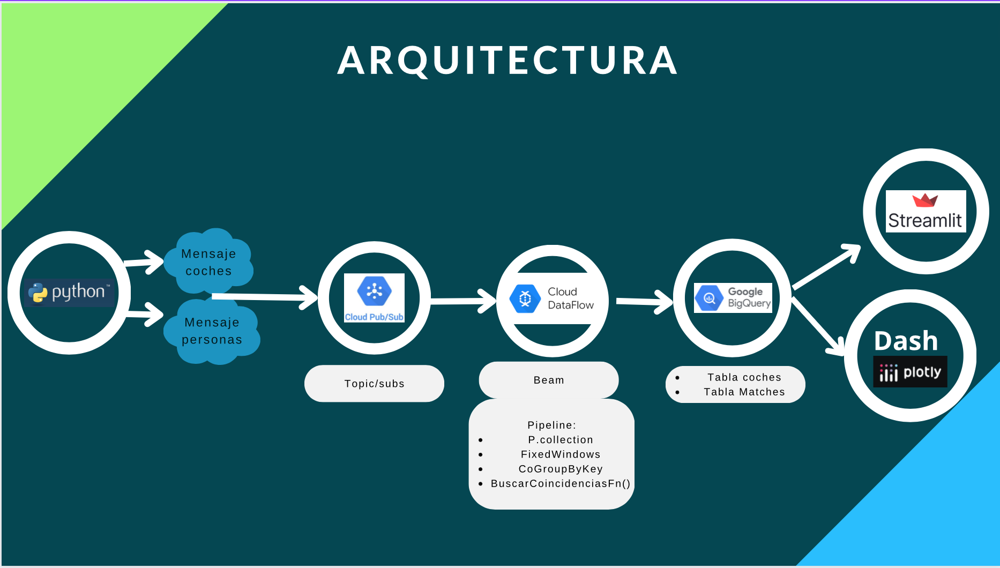

# BlaBlaCar CityConnect

Bla Bla Car ha decidido dar el salto a pelear en el mercado de los viajes de corta distancia. Para lograr reservas en tiempo real de desplazamientos urbanos ha elegido la ciudad de Valencia y a nuestro gran equipo para desarrollar la solución. 
El equipo está compuesto por Antonio Faura Vidaurre, Miguel Herrero Fuertes, Andrés Roncancio Salamanca e Inés Soler Soler.

Para desarrollar el prototipo inicial se han creado datos ficticios tanto de los coches como de las personas participantes.
Los datos se envían como mensajes a dos topics diferentes de Pub/Sub.
Un ejemplo de los mensajes de los coches, con sus características y estructura: 
> {"car_id": "coche_20", "destino_coche": "Ciudad_de_las_Artes_a_Av_Professor_Lopez", "lat": 39.48267, "lon": -0.35433, "plazas_disponibles": 3, "personas_transportadas": 0, "timestamp": 1708275810.062701}

Los mensajes de las personas se envían en el siguiente formato:
> {'persona_id': 1103, 'nombre': 'Darío Figueroa', 'lat': 39.44267, 'lon': -0.37863, 'presupuesto': 19.9, 'timestamp': 1708275807.0106812}

Para llevar a cabo este proyecto hemos definido la siguiente arquitectura:

## Arquitectura

Una vez los mensajes se han consumido por Dataflow, entran por un Pipeline que nos permite realizar match entre los coches y personas basados en su proximidad (max:4km).
## Jobs

Lo anterior genera una tabla en BQ (Matches) de la cual podemos hacer seguimiento del comportamiento, estadisticas y ocupacion de los coches en tiempo real

## BigQuery

